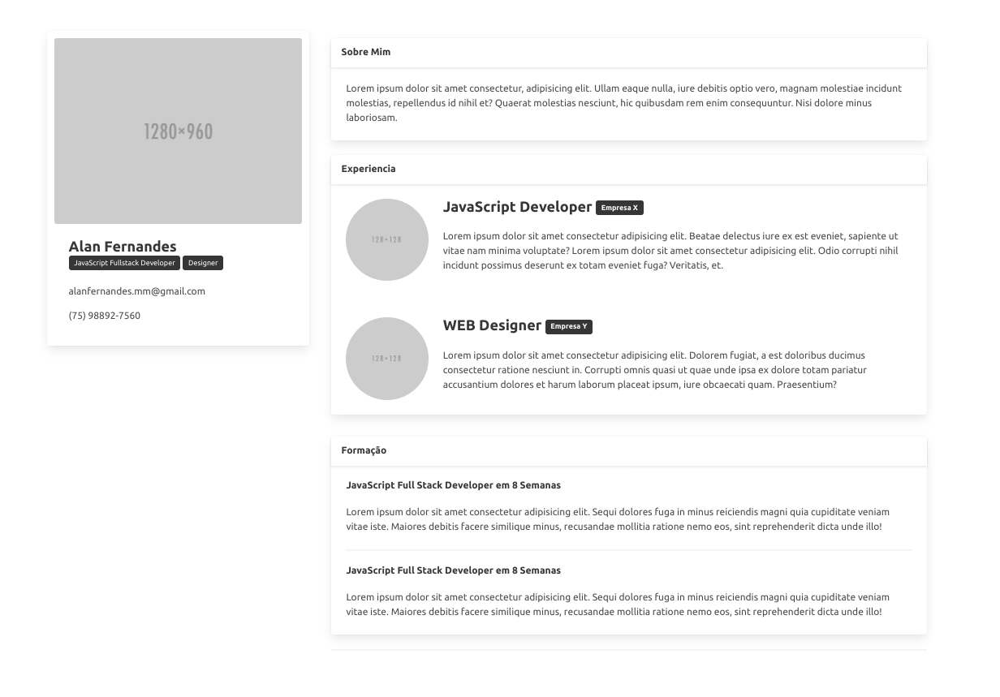
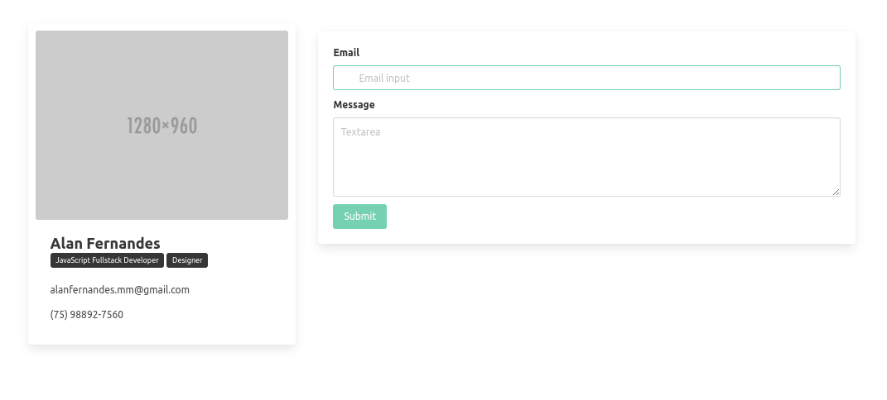

# Criando um modelo de portfólio com BULMA

Este Projeto foi criado para colocar em prática meus conhecimentos adquiridos sobre HTML5 e CSS3 e BULMA.

O objetivo desse projeto foi aplicar meus aprendizados em CSS utilizando o Framework BULMA para facilitar a estilização da pagina além de tonar mais bonita e responsiva 

## Tecnologias utilizadas

* HTML5
* CSS
* BULMA
## Layout do projeto

### Autor

LinkedIn:https://www.linkedin.com/in/alan-fernandes-03096317b/

Instagram: https://www.instagram.com/_alanfernds/

E-mail: alanfernandes.mm@gmail.com

